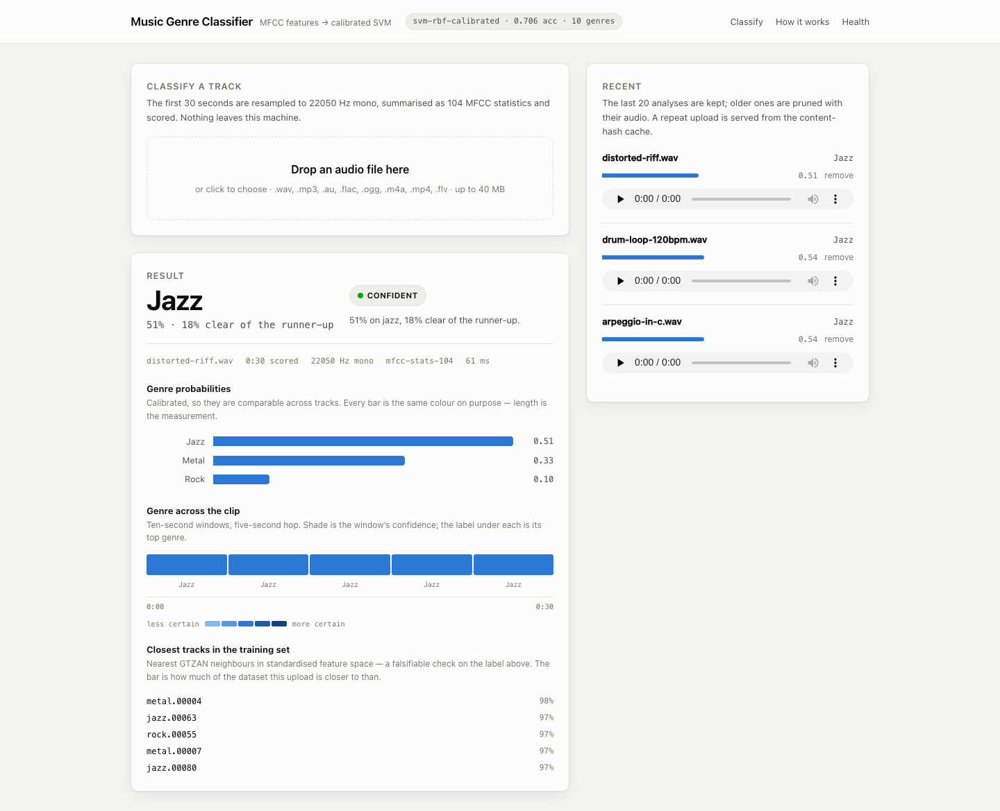
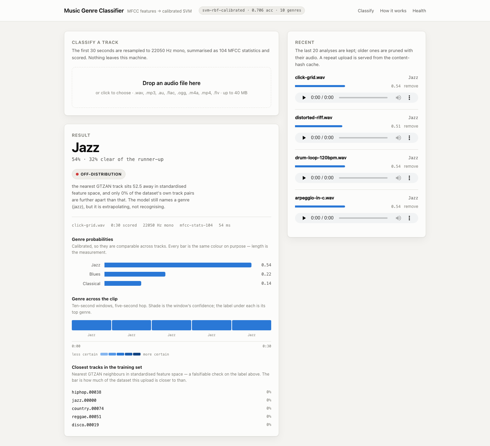
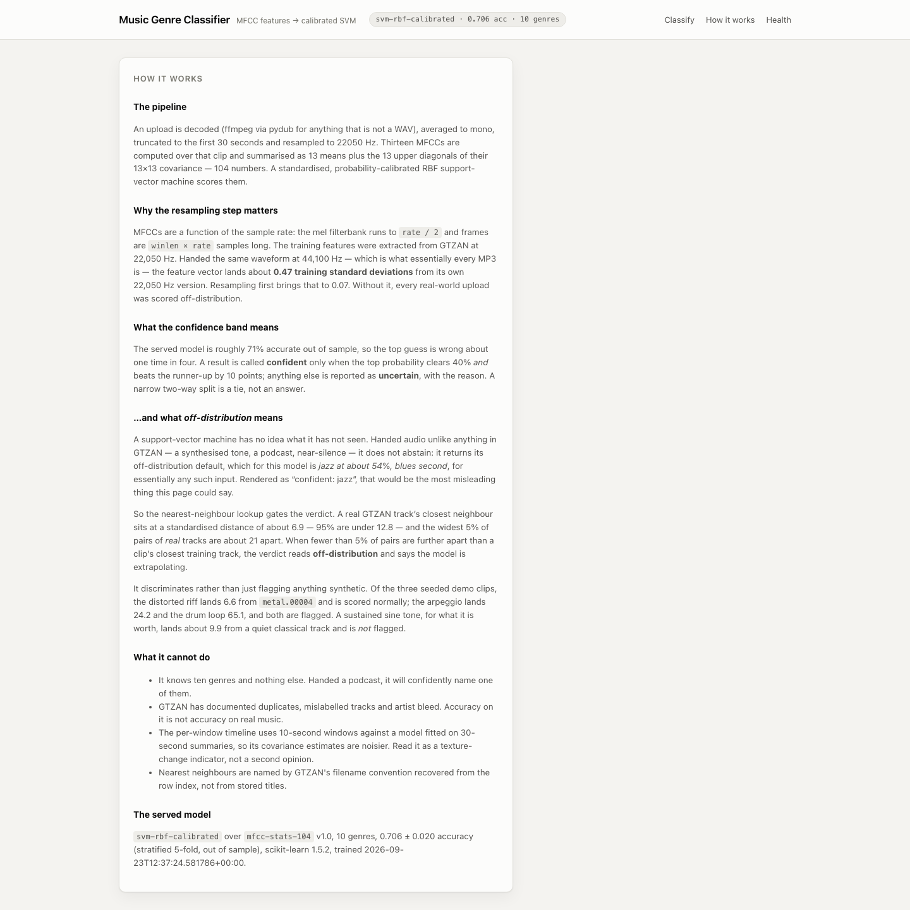
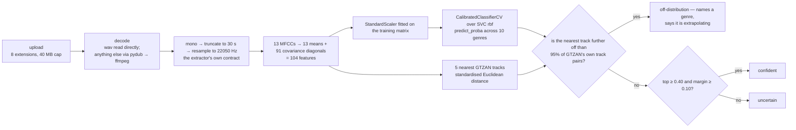
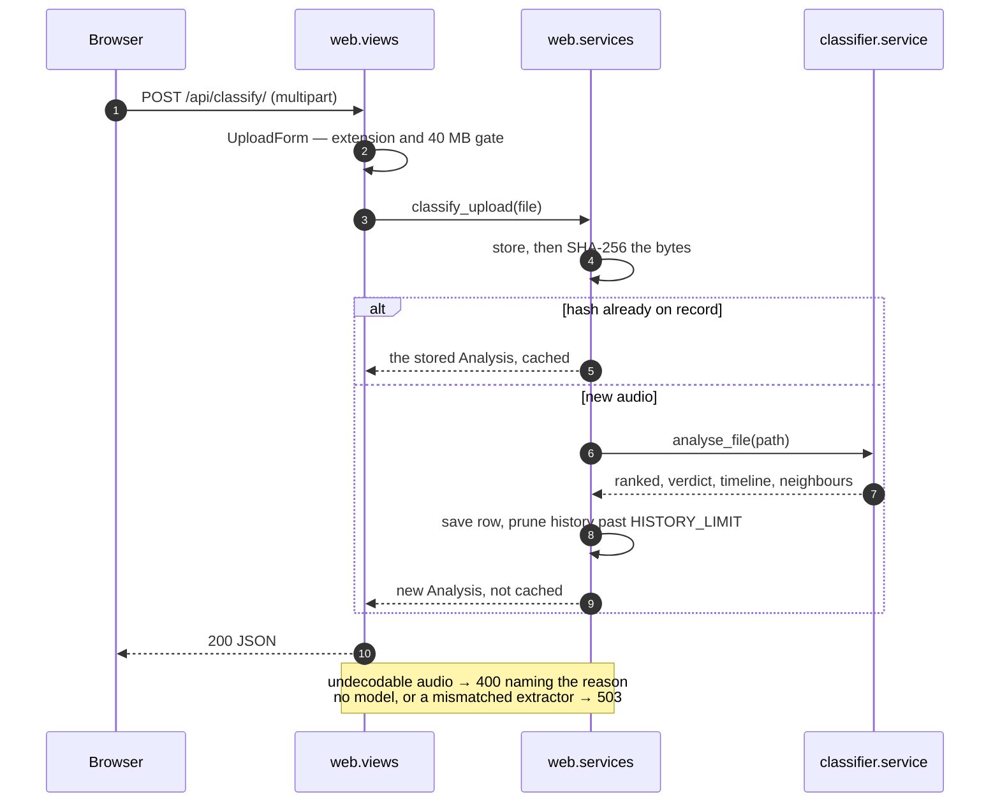

# Music Genre Classifier

Upload a track; get a ranked genre from a probability-calibrated RBF support-vector
machine over 104 MFCC statistics, trained on the GTZAN collection. Next to the
probabilities it shows the closest tracks in the training set and — when the audio
is nothing like anything it was trained on — says so instead of asserting a genre.

Django in front, scikit-learn behind it. No GPU, no API key, no dataset download:
the extracted feature matrix is in the repository, the 1.2 GB of GTZAN audio is not.

## Run it

```bash
docker compose up --build        # → http://localhost:8310
docker compose down -v           # stop, and drop the uploads volume
```

One command, no manual steps. The image trains the model at build time from
`data/Xall.npy`, and the entrypoint migrates and seeds three analysed clips, so the
first page is populated rather than an empty form.

Locally, on Python 3.11 or 3.12 (newer has no wheels for the pinned numpy and
scikit-learn):

```bash
python3.12 -m venv project_venv
./project_venv/bin/pip install -r requirements.txt -r requirements-dev.txt
./project_venv/bin/python -m classifier.train        # writes artifacts/
./project_venv/bin/python manage.py migrate
./project_venv/bin/python manage.py seed_demo
./project_venv/bin/python manage.py runserver 0.0.0.0:8310
```

Uploads accept `.wav`, `.mp3`, `.au`, `.flac`, `.ogg`, `.m4a`, `.mp4` and `.flv` up
to 40 MB. Only `.wav` is read directly; everything else goes through pydub, which
shells out to **ffmpeg** — the image installs it, a local checkout needs it on `PATH`.

**Container status**, from this repo's build log: *config parse verified* (`docker
compose config`); *build verified* (`docker compose build` / `up -d --build` against
the final application code — the last successful build came after the warm-up change
in `web/apps.py`); *boot verified* — the container reached `healthy` in ~15 s,
`GET /healthz/` returned `{"status":"ok","model_loaded":true,…}`, `/api/model/`
reported `svm-rbf-calibrated` at 0.706, `/api/history/` returned the three seeded
analyses, `GET /` returned 200. It was torn down with `docker compose down -v` and has
**not** been re-run since; the only things that changed afterwards were `tests/` and
this README, both excluded by `.dockerignore`.

## What it gives you back



The label is *jazz* at 0.51 — but the nearest training tracks are `metal.00004`,
`jazz.00063`, `rock.00055`. The neighbour panel is a falsifiable check on the headline,
not decoration: if the neighbours disagree with the label, the label is what is wrong.



The same page for a synthetic click grid. An SVM does not abstain, so the verdict is
driven by how far the clip sits from the training set — 52.5 away, with under 0.2% of
GTZAN's own track pairs that far apart — rather than letting 54% read as confidence.



The in-app **How it works** page states the pipeline, the confidence bands and the
limits, so nobody reads a number without its caveats.

## From upload to verdict



Truncation happens *before* resampling, so a long upload cannot buy more work, and the
size cap is applied before anything is decoded. The 104 numbers are exactly the maths
that produced the shipped feature matrix: `tests/test_features.py` pins the extractor
against an independent transcription of the original 2017 inner loop to
`rtol=atol=1e-12`, at three clip lengths.

Warm, a full analysis is about **50 ms** (median of 10 on an Apple Silicon laptop:
decode 0.5 ms, extract 17 ms, `predict_proba` 0.7 ms, five timeline windows 33 ms,
neighbours 0.2 ms); the two screenshots above report 61 ms and 54 ms end to end through
the page. Cold start is the interesting part, and `web/apps.py` explains it in its
docstring: the FFT under `python_speech_features` warms *per input length*, so the app
runs one complete 30-second analysis at worker boot rather than just loading the model.

## One extractor, and a model that refuses to load without it

The feature matrix was extracted in 2017 by one implementation; the web app extracted
its own features with a second copy of the same maths. That is textbook train/serve
skew, and the two copies disagreed on two things — both re-measured here against the
three synthesised demo clips (each up-sampled to 44.1 kHz to stand in for a user's
file; "stereo" is that clip in two identical channels), as a mean per-feature gap in
units of training standard deviation:

| Comparison | Mean divergence, over the 3 demo clips |
|---|---|
| a 44.1 kHz waveform framed at 44.1 kHz, vs. its 22.05 kHz self | **0.6 – 7.2 SD** |
| the same waveform resampled to 22.05 kHz first | **0.01 – 0.32 SD** |
| stereo handed straight to `mfcc`, vs. averaged to mono | **0.2 – 3.6 SD** |

The mechanism is not subtle: `python_speech_features` derives its mel filterbank from
`rate / 2` and frames at `winlen * rate` samples, so an MFCC is a function of the
sample rate. GTZAN is 22,050 Hz mono; essentially every MP3 a user owns is 44,100 Hz
stereo. (`classifier/audio.py` quotes 0.47 → 0.07 SD for the first comparison on other
audio. The magnitude is signal-dependent — the sign is not.)

There is now one `FeatureExtractor`, and it owns its preprocessing contract — rate,
channels, clip length — instead of leaving it to whichever caller happens to invoke it.
That contract is written into the artifact metadata at training time
(`artifacts/genre_classifier.json` carries `extractor`, `extractor_version`,
`sample_rate`, `clip_seconds`), and the load path **refuses** a mismatch:

- `classifier/predict.py` raises `ExtractorMismatch` when the recorded extractor is not
  the installed one, rather than scoring the wrong numbers;
- `web/views.py` turns that into a 503, not a prediction;
- `tests/test_views.py::test_a_mismatched_extractor_refuses_to_serve` pins it.

The feature matrix is loaded with `np.load(..., allow_pickle=False)`. With pickling
left on — the numpy default until you think about it — a crafted `.npy` is arbitrary
code execution at import time. It is a float array; it needs none of that.

## Saying "I don't know"

Handed audio unlike anything in GTZAN, the SVM does not abstain. It returns its
off-distribution default, which for this model is **jazz at about 0.54, blues second**,
for essentially any such input. Rendered as "confident: jazz", that is the most
misleading thing the interface could say — so the nearest-neighbour index gates the
verdict, and it discriminates rather than firing on anything synthetic:

| Clip | Nearest GTZAN track | Distance | Verdict |
|---|---|---|---|
| a real GTZAN track's own nearest neighbour | — | 6.9 median, 12.8 at the 95th pct | — |
| `distorted-riff.wav` | `metal.00004` | 6.6 | scored normally (jazz 0.51) |
| `arpeggio-in-c.wav` | `jazz.00032` | 24.2 | off-distribution |
| `drum-loop-120bpm.wav` | `hiphop.00038` | 65.1 | off-distribution |

When fewer than 5% of GTZAN's own track pairs are further apart than a clip is from its
closest training track, the verdict reads `off-distribution` and says the model is
extrapolating. The threshold is a percentile of the dataset's own distance distribution
rather than a magic number, so it survives the matrix being regenerated — and it costs
nothing extra, because the index was already built for the neighbour panel.

## The numbers, and how to regenerate them

```bash
./project_venv/bin/python -m classifier.evaluate --raw
```

Stratified 5-fold cross-validation over the whole matrix, fixed seed. The earlier
version of this comparison selected a random subset per class with an unseeded
`random.choice`, so its numbers could not be reproduced even by itself; that is the
part worth fixing before any of the rest.

```
All 10 genres, standardised          All 10 genres, raw features
classifier          train   test     classifier          train   test
------------------------------       ------------------------------
SVM RBF             0.928  0.728     SVM linear          0.998  0.670
Logistic Regression 0.981  0.719     Logistic Regression 0.998  0.647
SVM linear          0.996  0.710     SVM RBF             0.729  0.630
K-Nearest Neighbors 0.767  0.639     K-Nearest Neighbors 0.742  0.614
SVM poly            0.684  0.445     SVM poly            0.681  0.542
random baseline            0.100     random baseline            0.100
```

**Standardising is the whole ballgame, and it changes which model wins.** The 104
features are not on a common scale — their standard deviations run from 1.86 to 59.66,
a factor of 32 — and both the SVMs and k-NN measure distance in that raw space, so a
handful of wide-range columns dominate every comparison. Scaling moves RBF from 0.630
to 0.728, and it is the only thing that makes the polynomial kernel *worse* (0.542 →
0.445). The project this grew out of published its table with no code behind it and
recommended the polynomial kernel; measured over the same matrix, poly is the worst of
the five and RBF the best. Both facts are recorded in `classifier/evaluate.py` and
`classifier/models.py`, next to the code that settles them. On the six genres the
original web app offered, the ordering holds and the ceiling is higher: SVM linear
0.853, RBF 0.848, logistic regression 0.842, k-NN 0.793, poly 0.568.

**The model actually served is not the best row on that table.** It is
`svm-rbf-calibrated` at **0.706 ± 0.020**, 2.2 points behind plain `SVC(kernel="rbf")`.
That is a deliberate trade: the interface shows probabilities, and an uncalibrated SVM's
`predict_proba` is a Platt-scaled score fitted by an internal cross-validation the
caller never sees. At ~71% accuracy the top guess is wrong about one time in four, and
a user who can see the runner-up was close is better served than one shown a
confident-looking number that does not mean what it appears to.

## What a request actually does



`classifier/` imports nothing from Django, so the whole inference path is exercisable
from a REPL or a test without a request, a database or a settings module; `web/` is the
adapter that parses, delegates, serialises and picks a status code. Inference is
deterministic, which is what makes the content hash a sound cache key: the same bytes
twice is a database lookup, and the duplicate file is discarded rather than stored
twice. The only two queries this app makes are "find by hash" and "the most recent N",
both indexed — there is no `.all()` anywhere, and a test would fail if one appeared.
SQLite is the right answer to that workload; the honest next bottleneck is CPU, so past
a handful of concurrent uploads the answer is a task queue and more workers.

## Environment

Every setting is read from the environment with a development default, so one image
runs locally and behind a real host without a second settings file.

| Variable | Default | What it does |
|---|---|---|
| `SECRET_KEY` | `dev-only-insecure-key-change-me` | Django signing key. The fallback is obviously not a secret. |
| `DEBUG` | `1` (compose sets `0`) | With `DEBUG=0` static files are served hashed through WhiteNoise, which is what the container does. |
| `ALLOWED_HOSTS` | `localhost,127.0.0.1,0.0.0.0,[::1]` | Comma-separated host allowlist. |
| `CSRF_TRUSTED_ORIGINS` | `http://localhost:8310` | Origins allowed to POST. |
| `SECURE_COOKIES` | `1` when `DEBUG=0` | Compose sets `0`: the demo is plain HTTP on localhost, where secure cookies are never stored and every POST would 403. Set it to `1` behind TLS. |
| `HISTORY_LIMIT` | `20` | Analyses kept. Every successful classification prunes past this, with the audio. |
| `WARM_MODEL` | `1` | Run one full analysis at process start so the first request is not the one that pays for it. |

`SERVE_MEDIA`, `DATABASE_PATH`, `MEDIA_ROOT`, `LOG_LEVEL` and `TIME_ZONE` are there
too, in `config/settings.py`; `PORT` and `WEB_CONCURRENCY` belong to the `Procfile`.

## Tests

```bash
./project_venv/bin/python -m pytest      # 198 passed in ~10 s
./project_venv/bin/ruff check .
```

Nothing in the suite needs GTZAN audio, a GPU, a network download or a real training
run: feature matrices and models are synthesised from a fixed seed in
`tests/conftest.py`, and the audio tests generate their own WAVs.

## Known limits

- **GTZAN is a flawed benchmark** — documented duplicate tracks, mislabelled examples,
  artist bleed between folds. Accuracy on it is not accuracy on real music, and every
  figure above inherits that.
- **It knows ten genres and nothing else.** Handed a podcast it will name one of them.
  The off-distribution verdict catches the clear cases; it is a distance threshold, not
  a classifier of "is this music".
- **The labels are stored nowhere.** They are implied by the row ordering of the feature
  matrix — 10 genres × exactly 100 tracks, in alphabetical blocks. `classifier/data.py`
  reconstructs them in one place, explains the assumption, and refuses to proceed if the
  matrix is not the shape that assumption requires; silently mislabelling every row
  would make every number here meaningless.
- **The audio is not in the repository**, only the features, so the extraction path is
  pinned against the original code and tested on synthetic audio — never re-validated
  against the original tracks. The seeded demo clips are synthesised too; nothing about
  their *analysis* is faked, but two of the three land off-distribution, which is the
  honest answer rather than an impressive one.
- **The timeline is noisier than the headline.** It scores 10-second windows with a
  model fitted on 30-second summaries, so its covariance estimates are worse estimates
  of the same quantity. Read it as a texture-change indicator, not a second opinion.
- **Features are 2017-era.** MFCC means and covariances were a reasonable choice then;
  a small CNN over mel-spectrograms would very likely do better, and is the honest next
  step rather than tuning these five classifiers further. The `FeatureExtractor` seam
  exists so that is a new class, not a rewrite.
- **One process, one machine.** No queue, no object storage, no horizontal scale, and
  `DEBUG` defaults to on locally. Set `DEBUG=0`, `SECRET_KEY`, `ALLOWED_HOSTS` and
  `SECURE_COOKIES=1` before exposing this to anything.
